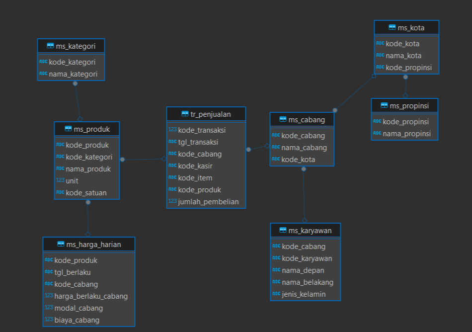

# Portfolio
---
## SQL

### Analyzing Minimart Data

My complete implementation of final assignments and projects in **Tetris Batch IV - Fast Track Data Analytics** by DQLab

Effective and efficient data can provide valuable insights for better decision-making, operational optimization, and overall business performance improvement. Minimarts, as small to medium-sized retail businesses, often face challenges in managing customer information, product inventory, operational efficiency, and more. The goal of this project is to conduct an analysis using minimart data with the expectation that the company can optimize operations, increase sales, and gain a competitive advantage..

---
## Excel Dashboard

My complete implementation of final assignments and projects in **Data Analytics** by Digital Skola

### Sales Performance Dashboard

The organization aims to conduct an in-depth analysis of its sales performance over a specified timeframe, with the goal of extracting valuable insights regarding customer segmentation preferences, sales and profit within product categories, shipping methods, and geographical locations.

 

### Product Sales Dashboard

Conducting an analysis of a sales dataset comprising customer information, product details, order records, and location specifics for a prominent stakeholder within the company. The objective is to furnish valuable insights and assist the stakeholders in attaining a more profound comprehension of their data.

 

---
